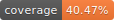

# Semantic UI Component for Vue2

[](https://circleci.com/gh/HandOfGod94/vue-semantic/tree/master)


> Work In Progress

This is just another attempt to create native Vue Components for
Semantic UI. It is different from Semantic-UI-Vue in a sense that
it's design is inspired from Vuetify and Bootstrap-Vue.

For documentation it still requires a lot of work.
More UT's and Components coming soon.

## Currently it has following modules
* Button
* Container
* Divider
* Header
* Image

## Build Setup

``` bash
# install dependencies
npm install

# serve with hot reload at localhost:8080
npm run dev

# build for production with minification
npm run build

# build for production and view the bundle analyzer report
npm run build --report

# run unit tests
npm run unit

# run all tests
npm test
```

For a detailed explanation on how things work, check out the [guide](http://vuejs-templates.github.io/webpack/) and [docs for vue-loader](http://vuejs.github.io/vue-loader).
